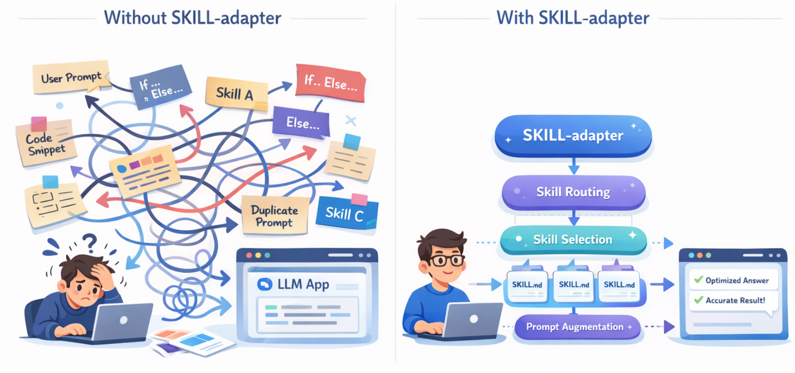

# SKILL-adapter 🧩



> 🚀 让任意 LLM 应用，以**低侵入**方式接入 `SKILL.md` 能力生态。

**SKILL-adapter** 是一个面向现有 LLM 系统的轻量级适配层。

它不要求你重写整套 Agent 框架，也不要求你迁移现有后端，只需要在原有模型调用前多接入一层，就能获得：

- 🧠 **Skill Routing**：根据用户 query 自动匹配最合适的 skill
- 🪄 **Prompt Augmentation**：将 skill 指令注入到最终请求中
- 🧩 **低侵入集成**：尽量不改动你已有的模型调用链路
- 🛡️ **安全回退**：即使命不中 skill，也不会阻塞原有流程


## ✨ 这个项目想解决什么问题？

现在很多基于 skill 的系统都存在一个共同问题：

- 你已经有了自己的 LLM 应用
- 你已经有自己的后端、API、业务流程
- 你也想复用越来越多的 `SKILL.md` 能力资产
- 但大多数方案都默认你要**迁移整个框架**

这其实很重，也很不现实。

**SKILL-adapter 想做的事情很简单：**

> ❌ 不是让你重写应用去适配 skill
> ✅ 而是让 skill 来适配你的应用

也就是说，它不是再造一个新的 Agent 框架，而是作为一个 **adapter 层**，插在你的现有系统和模型调用之间。


## 🧭 它是怎么工作的？

整个流程可以理解成：

```
用户 Query → Skill Routing → Skill 选择 → Prompt Augmentation → 现有 LLM 应用 → 模型输出
```

也就是说，你原本的系统可以保持不变：

- 原有 API 服务不动
- 原有模型客户端不动
- 原有业务逻辑不动
- 原有推理调用方式尽量不动

你只是在模型调用前，多加了一层 **技能感知能力**。


## 🔥 没有它 vs 有了它

### ❌ 没有 SKILL-adapter

很多 LLM 项目最后会慢慢变成这样：

- prompt 模板散落在各个业务代码里
- skill 逻辑靠手写 if / else 维护
- 新能力接入越来越重
- 查询路由越来越乱
- prompt 工程难以复用
- 业务系统和能力层强耦合

最后的结果就是：

> 😵 系统能跑，但是越来越难扩展、越来越难维护。

------

### ✅ 有了 SKILL-adapter

你可以把 skill 从零散 prompt，变成一个**可检索、可路由、可注入、可复用**的能力层：

- 📌 根据 query 自动匹配 skill
- 📚 复用已有 `SKILL.md`
- 🧠 支持关键词 / 语义 / 混合检索
- 🪄 自动增强最终 prompt / payload
- 🧩 尽量不破坏现有系统结构
- 🛟 没命中 skill 时平滑回退

最后形成一个更清晰的结构：

> 😌 业务系统负责业务，adapter 负责能力接入，skill 负责行为增强。


## 🔧 快速部署

```bash
git clone https://github.com/Yirzzzz/SKILL-adapter.git
cd SKILL-adapter
pip install -e .
```


## 🚀 1 分钟接入示例

```python
# 原来代码
response = client.chat.completions.create(
    model='Qwen/Qwen3-8B', # ModelScope Model-Id, required
    messages=[
        {
          'role': 'user',
          'content': '9.9和9.11谁大'
        }
    ],
    stream=True,
    extra_body=extra_body
)

# 接入后代码
from skill_adapter import SkillRuntime

runtime = SkillRuntime(skill_dirs=["./skills"]) # 定义skills路径

prepared = runtime.prepare(
    query="9.9和9.11谁大",
    payload={"messages": [{"role": "user", "content": "9.9和9.11谁大"}]},
    mode="messages",
    debug=True,
)

response = client.chat.completions.create(
    model="Qwen/Qwen3-8B",
    **prepared.payload,
    stream=True,
    extra_body=extra_body
)
```


## 🛣️ route 示例

通过该代码可以查看 SKILL 检索召回的结果

```python
selection = runtime.route(query="请总结这篇论文", debug=True)
print(selection.selected_skills)
print(selection.candidates)
print(selection.reason)
```

除此之外，项目提供一个基于 `FastAPI` 的本地 web 可视化页面， 🌐，用于观察：

- query 调整后的召回变化
- BM25 候选、semantic 候选、fused ranking
- raw score / final score
- 最终 selected skill
- prepare 后 payload
- trace / registry errors / retrieval errors

运行方式：

```bash
pip install -e ".[viz]"
uvicorn examples.retrieval_web.app:app --reload --port 8000
```

然后访问：

```text
http://127.0.0.1:8000
```

页面支持：
- 修改 query
- 调整 `top_k` / `bm25_top_k` / `semantic_top_k`
- 调整 `activation_threshold`
- 调整 `bm25_weight` / `semantic_weight`
- 开关 BM25 / semantic retrieval
- 查看 selected skill 的全文预览
- 对比 `route()` 与 `prepare()` 的 trace


## 💬 prepare(messages) 示例

```python
prepared = runtime.prepare(
    query="解释这段代码",
    payload={"messages": [{"role": "user", "content": "解释这段代码"}]},
    mode="messages",
    debug=True,
)

response = client.chat.completions.create(
    model="Qwen/Qwen3-8B",
    **prepared.payload,
)
```

## 📝 prepare(input) 示例 

```python
prepared = runtime.prepare(
    query="你好，介绍一下你自己",
    payload={"input": "你好，介绍一下你自己"},
    mode="input",
    debug=True,
)

response = client.responses.create(
    model="gpt-5",
    **prepared.payload,
)
```

## 🧪 trace/debug 示例

```python
{
  "query": "请总结这篇论文",
  "bm25_candidates": [
    {"skill": "paper-summary", "score": 3.12, "reason": "bm25 matched_tokens=['论', '论文']"}
  ],
  "semantic_candidates": [
    {"skill": "paper-summary", "score": 0.91, "reason": "semantic similarity on retrieval_text"}
  ],
  "fused_candidates": [
    {
      "skill": "paper-summary",
      "bm25_score": 3.12,
      "semantic_score": 0.91,
      "final_score": 2.015,
      "reason": "hybrid fusion raw_bm25=3.12 raw_semantic=0.91"
    }
  ],
  "selected_skills": [{"skill": "paper-summary", "score": 2.015}],
  "activation_threshold": 0.35,
  "fallback": False,
  "loaded": True,
  "mode": "messages",
  "reason": "paper-summary has the highest fused score"
}
```

如果语义模型不可用，系统不会打断主流程，而是记录在 trace 里：

```python
{
  "retrieval_errors": [
    "semantic retrieval unavailable: sentence-transformers is required for semantic retrieval"
  ]
}
```


## 🏗️ 项目结构与模块说明

```text
skill-adapter/
  README.md
  pyproject.toml
  src/skill_adapter/
    __init__.py
    runtime.py          # 对外核心：route + prepare
    config.py           # SkillConfig
    models.py           # 数据结构
    discovery.py        # 本地 skill 目录扫描
    parser.py           # SKILL.md metadata 解析
    registry.py         # metadata 索引
    tokenizer.py        # 中英混合轻量 tokenizer
    routing.py          # hybrid retrieval + activation
    loading.py          # lazy load selected skills
    augmentation.py     # payload 增强
    retrieval/
      __init__.py
      base.py
      bm25.py           # BM25 检索
      semantic.py       # embedding 语义检索
      hybrid.py         # 融合排序
  examples/
    route_demo.py
    hybrid_debug_demo.py
    prepare_messages_demo.py
    prepare_input_demo.py
    skills/
      paper-summary/SKILL.md
      web-summary/SKILL.md
      code-explain/SKILL.md
```


## Retrieval Mode Configuration

You can now switch retrieval pipelines via `SkillConfig(retrieval_mode=...)` without changing runtime code.

Supported modes:

- `bm25_sentence` (default): BM25 + sentence-transformers hybrid. Fully implemented. Legacy baseline.
- `bm25_bge_m3`: BM25 + BGE-M3 dense hybrid. Fully implemented. Recommended baseline for phase-2 benchmark.
- `bge_m3_rerank`: BGE-M3 first-stage + reranker pipeline. Implemented (with dependency fallback).
- `bm25_bge_m3_rerank`: BM25 + BGE-M3 first-stage + reranker pipeline. Implemented (with dependency fallback).

Example 1 (legacy baseline):

```python
from skill_adapter import SkillConfig, SkillRuntime

runtime = SkillRuntime(
    config=SkillConfig(
        skill_dirs=["./skills"],
        activation_threshold=0.15,
        retrieval_mode="bm25_sentence",
    )
)
```

Example 2 (phase-2 baseline):

```python
from skill_adapter import SkillConfig, SkillRuntime

runtime = SkillRuntime(
    config=SkillConfig(
        skill_dirs=["./skills"],
        activation_threshold=0.15,
        retrieval_mode="bm25_bge_m3",
        bge_m3_model_name="BAAI/bge-m3",
    )
)
```

Trace now includes pipeline metadata:

- `retrieval_mode`
- `semantic_backend`
- `reranker_enabled`

If you prefer hard-fail instead of fallback when retrieval dependencies/models are unavailable, set:

```python
SkillConfig(..., strict_retrieval=True)
```

